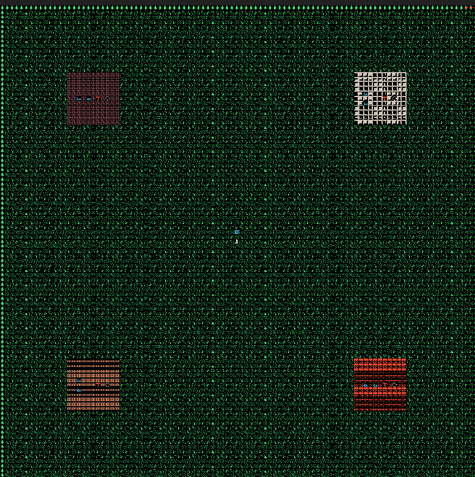
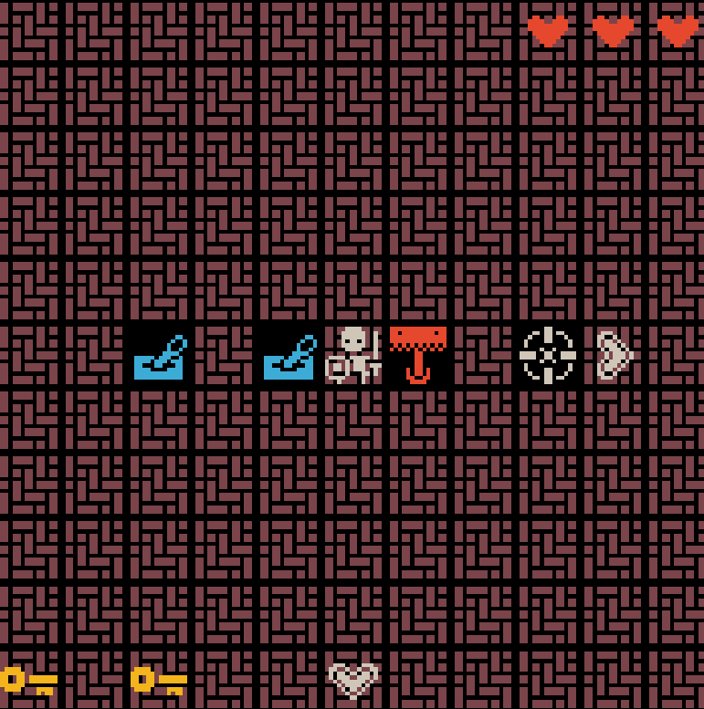
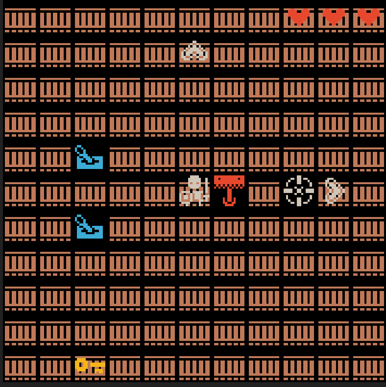

# LogicFlow

A top-down RPG built in MATLAB where you solve logic gate puzzles. Explore a scrolling world, visit four biomes (AND, OR, XNOR, NAND), flip levers to satisfy each gate's truth table, collect keys, and unlock the final door.

Final project for ENGR 1181 at The Ohio State University.

---

## Screenshots

| Start Screen | Game Over | Win Screen |
|:---:|:---:|:---:|
|  |  |  |

---

## Gameplay

You start at the center of a 100x100 tile world. Each corner has a biome with a logic gate puzzle — flip the two input levers (A and B) to get the correct output, then confirm. Solve all four to collect the keys, return to the door, and win.

| AND Gate Biome | OR Gate Biome |
|:---:|:---:|
|  |  |

**Controls**

| Key | Action |
|-----|--------|
| Arrow Keys | Move |
| Space | Interact with lever |
| P | Pause |
| Escape | Quit |

---

## How to Run

Requires MATLAB R2020a or later (no extra toolboxes needed).

1. Clone the repo
2. 2. Open MATLAB and set the working directory to `src/`
   3. 3. Run `logic_flow_main`
     
      4. > Ohio State students have free MATLAB access through the university license.
         >
         > ---
         >
         > ## Logic Gates
         >
         > | Biome | Gate | Condition |
         > |-------|------|-----------|
         > | Top-Left | AND | Output = 1 only when A=1 and B=1 |
         > | Top-Right | OR | Output = 1 when A=1 or B=1 |
         > | Bottom-Left | XNOR | Output = 1 when A and B are equal |
         > | Bottom-Right | NAND | Output = 1 unless both A=1 and B=1 |
         >
         > ---
         >
         > ## About
         >
         > Made by **Aryan Gujral** for ENGR 1182 (Engineering Design) at Ohio State, Spring 2025.
         >
         > [LinkedIn](https://www.linkedin.com/in/aryan-gujral/) · [GitHub](https://github.com/AryanG3107)
