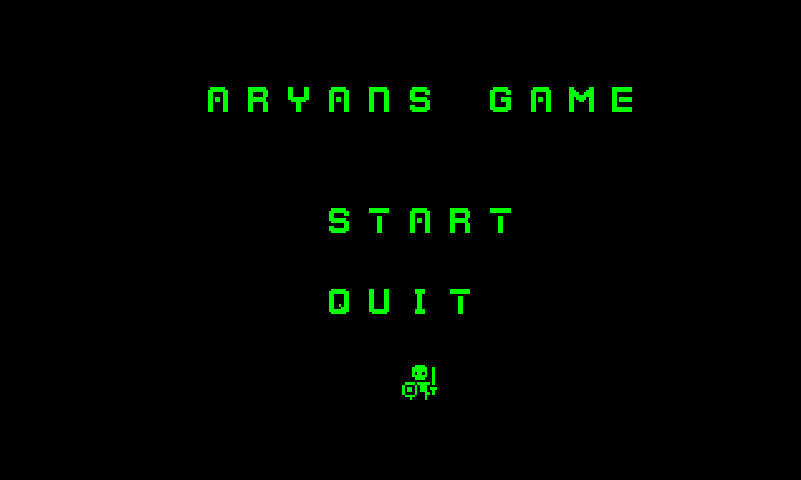

# LogicFlow

An educational top-down RPG built in MATLAB that teaches logic gates through gameplay. Players explore a scrolling open world, visit four biomes each representing a different logic gate (AND, OR, XNOR, NAND), solve puzzles by flipping levers to satisfy each gate's truth table, collect keys, and unlock the final door to win.

Built as a final project for ENGR 1182 (Engineering Design) at The Ohio State University.

---

## Gameplay



The player spawns in the center of a 100x100 tile world. Four biomes are placed in the corners of the map, each containing:
- Two input levers (A and B)
- A confirm lever to submit the answer
- A light that turns on when the answer is correct
- A key that drops when the puzzle is solved

Collect all four keys, return to the door near the spawn, and enter to win.

**Controls**

| Key | Action |
|-----|--------|
| Arrow Keys | Move |
| Space | Interact with adjacent lever |
| P | Pause |
| Escape | Quit to Game Over |

---

## Technical Overview

### Scrolling Camera with Border Lock System

The camera viewport is an 11x11 tile window over a 100x100 world map. Rather than simply centering on the player at all times, the system uses a border-lock state variable per axis (`borderLockRow`, `borderLockCol`) to handle edge behavior:

- When the player approaches a world border and the camera can no longer scroll, the lock engages (`-1` for top/left, `+1` for bottom/right)
- While locked, the player sprite moves freely within the viewport
- When the player reverses direction and reaches the viewport center, the lock releases and camera scrolling resumes

This is implemented in `gameLoop.m` and produces smooth, Zelda-style scrolling behavior.

### Matrix-Based Viewport Extraction

Each frame, the visible portion of the world is extracted as a 2D matrix slice:

```matlab
viewBg = worldBg(camTopWorldRow:camBottomWorldRow, camLeftWorldCol:camRightWorldCol);
```

Foreground elements (player, HUD, keys, arrows) are composited on top in `buildFrame.m` by computing screen-space coordinates from world-space positions:

```matlab
playerRowScreen = playerRowWorld - camTopWorldRow + 1;
playerColScreen = playerColWorld - camLeftWorldCol + 1;
```

This approach avoids storing a separate foreground world map and recomputes the full frame each tick.

### Inventory and Key State Machine

Each key uses a 3-state integer:

| Value | Meaning |
|-------|---------|
| `0` | Puzzle not yet solved |
| `1` | Key dropped on ground (puzzle solved) |
| `2` | Key picked up, in inventory |

This state is tracked per gate (`andKey`, `orKey`, `xorKey`, `notKey`) and drives HUD rendering, ground sprite placement, and door unlock logic.

### Directional HUD Arrows

To help players navigate to the door across the large map, directional arrow sprites are rendered on the viewport border pointing toward the door's world position relative to the player's current world position. Arrows only render on the axis where the door is out of frame.

### Sprite Tinting

Menu screens apply full RGB overrides to sprite color channels at runtime to produce themed visuals without needing separate sprite assets:

```matlab
% Green tint for start screen
sprite(:,:,1) = 0;
sprite(:,:,2) = 255;
sprite(:,:,3) = 0;
```

Red is used for Game Over, aqua for Win.

---

## File Structure

```
LogicFlow/
├── src/
│   ├── logic_flow_main.m      # Entry point: world setup and game loop orchestration
│   ├── gameLoop.m             # Core game loop: input, movement, collision, camera, logic checks
│   ├── buildFrame.m           # Composes each rendered frame from world state
│   ├── simpleGameEngine.m     # Sprite rendering engine (OOP, provided by course)
│   ├── gameStartFunction.m    # Start screen
│   ├── gameOverFunction.m     # Game over screen
│   ├── gameWinFunction.m      # Win screen
│   ├── pauseScreen.m          # Pause overlay
│   ├── showMessage.m          # Blocking message display utility
│   └── TileBrowser.m          # Dev tool: browse and identify tile IDs from sprite sheet
├── assets/
│   └── retro_pack.png         # 16x16 sprite sheet (1000+ tiles)
├── docs/
│   └── screenshots/
└── README.md
```

---

## How to Run

**Requirements:** MATLAB R2020a or later (no additional toolboxes required)

1. Clone or download the repository
2. Open MATLAB and set the working directory to the `src/` folder
3. Make sure `retro_pack.png` is in the `assets/` folder one level up, or copy it into `src/`
4. Run:
```matlab
logic_flow_main
```

> Note: MATLAB is required to run this project. A free trial is available at [mathworks.com](https://www.mathworks.com/campaigns/products/trials.html). Ohio State students have free access through the university license.

---

## Logic Gates Covered

| Biome | Gate | Truth Condition |
|-------|------|-----------------|
| Top-Left | AND | Output = 1 only when A=1 and B=1 |
| Top-Right | OR | Output = 1 when A=1 or B=1 (or both) |
| Bottom-Left | XNOR | Output = 1 when A and B are equal |
| Bottom-Right | NAND | Output = 1 unless both A=1 and B=1 |

---

## About

Developed by **Aryan Gujral** as part of ENGR 1182 (Engineering Design) at The Ohio State University, Spring 2025. The game was designed to be used as an interactive teaching tool for middle and high school students learning digital logic fundamentals.

- [LinkedIn](https://linkedin.com/in/aryang3107)
- [GitHub](https://github.com/AryanG3107)
